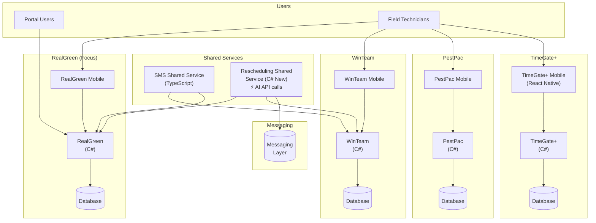
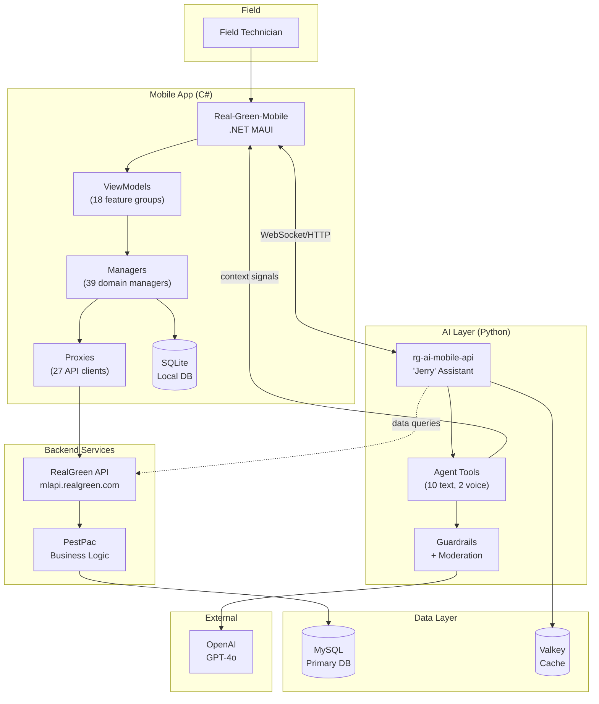
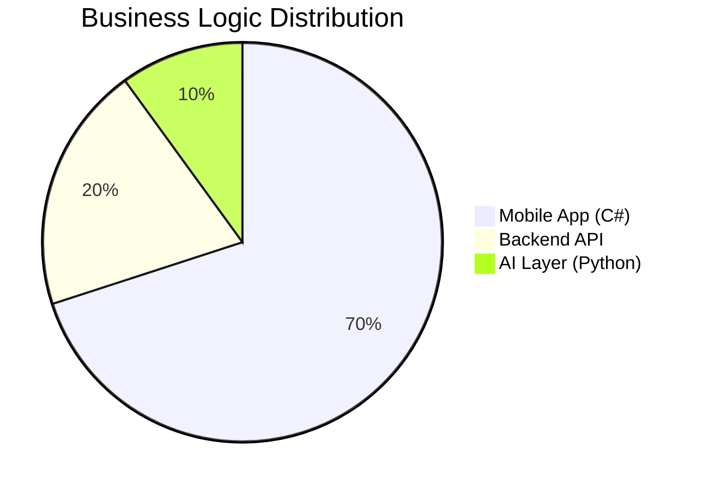
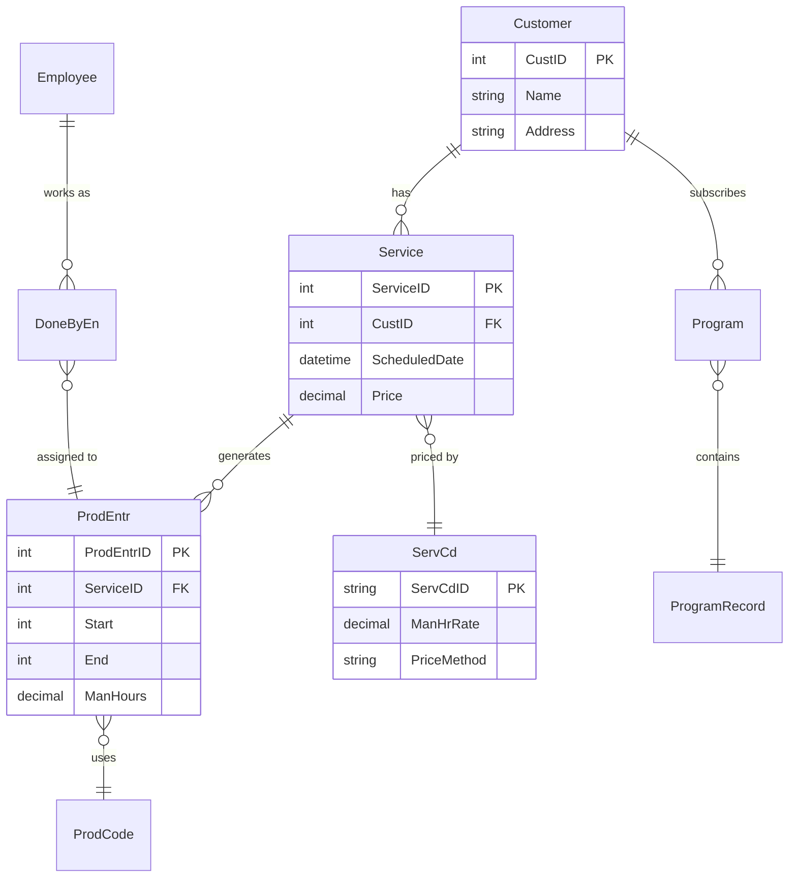

# RealGreen Mobile System Overview

> End-to-end architecture for field service technicians with AI assistance.

**Purpose:** Reference document for architecture discussions and domain discovery planning.

---

## WorkWave Product Ecosystem

RealGreen is one of four main product lines in the WorkWave portfolio, each with similar architecture patterns.



### Product Line Comparison

| Product | Backend | Mobile | Mobile Tech | AI Integration |
|---------|---------|--------|-------------|----------------|
| **WinTeam** | C# (Current) | WinTeam Mobile | C# | Via Rescheduling Service |
| **RealGreen** | C# (Current) | RealGreen Mobile | C# (.NET MAUI) | Jerry (rg-ai-mobile-api) |
| **PestPac** | C# (Current) | PestPac Mobile | C# | - |
| **TimeGate+** | C# (Current) | TimeGate+ Mobile | React Native | - |

### Shared Services

| Service | Technology | Purpose |
|---------|------------|---------|
| **SMS Shared Service** | TypeScript | Cross-product SMS delivery |
| **Rescheduling Shared Service** | C# (New) | Appointment scheduling with AI API calls |

**Key Insight:** The Rescheduling Shared Service is a newer C# service with AI capabilities, representing a potential architecture pattern for extracting business logic from mobile apps into shared services.

### Strategic Implications

| Pattern | Current State | Future Opportunity |
|---------|---------------|-------------------|
| **Business Logic** | Scattered in 4 mobile apps | Extract to shared services (like Rescheduling) |
| **AI Integration** | RealGreen-specific (Jerry) | Could expand to other products |
| **Domain Knowledge** | Tribal, undocumented | Domain maps could serve all products |
| **Shared Services** | SMS, Rescheduling | More candidates after domain mapping |

The domain discovery workflow designed for RealGreen could become a template for documenting business logic across all WorkWave mobile apps.

---

## RealGreen Focus Area

This document focuses on the **RealGreen** product line, specifically:
- **Real-Green-Mobile** (C# mobile app)
- **rg-ai-mobile-api** (Python AI assistant "Jerry")

---

## System Components

| Component | Technology | Role |
|-----------|------------|------|
| **Real-Green-Mobile** | .NET 9/MAUI (C#) | Field technician mobile app |
| **rg-ai-mobile-api** | FastAPI (Python) | AI assistant "Jerry" API |
| **RealGreen Backend** | PestPac APIs | Core business data services |
| **SQLite** | Local DB | Offline-capable mobile storage |
| **MySQL** | Backend DB | Persistent business data |

---

## End-to-End Architecture



---

## Data Flow Patterns

### Pattern 1: Standard Mobile Operation
```
Technician → UI → ViewModel → Manager → Proxy → RealGreen API → MySQL
                                    ↓
                               SQLite (local cache)
```

### Pattern 2: AI-Assisted Operation
```
Technician → "Hey Jerry, start timer" → Mobile App
                                            ↓
                                    rg-ai-mobile-api (Jerry)
                                            ↓
                                    GPT-4o (reasoning)
                                            ↓
                                    Tool: request_production_timer_toggle
                                            ↓
                                    Signal → Mobile App
                                            ↓
                                    Manager executes business logic
                                            ↓
                                    Proxy → API → MySQL
```

---

## The Problem: Where Business Logic Lives



**Current State:**
- **70% in Mobile** - Managers contain pricing, validation, workflow rules
- **20% in Backend** - Data persistence, authentication, basic CRUD
- **10% in AI Layer** - Tool orchestration, user intent parsing

**Impact on AI Development:**
- Jerry's tools call mobile app, which executes business logic
- AI team must understand C# codebase to build correct tools
- Domain knowledge scattered across 39 managers

---

## Key Domain Areas

| Domain | Mobile Manager | AI Tool | Backend Endpoint |
|--------|---------------|---------|------------------|
| **Timers** | ServiceTimersManager | `request_production_timer_toggle` | QuickProductionProxy |
| **Time Clock** | TimeClockManager | `request_time_clock_toggle_tool` | TimeClockProxy |
| **Jobs** | ServiceManager | `get_job_program_details_tool` | RouteProxy |
| **Notes** | NotesManager | `add_job_note` | - |
| **Weather** | - | `get_current_weather_tool` | WeatherProxy |
| **History** | CustomerInfoManager | `get_customer_history_tool` | CustomerContactInfoProxy |

---

## Critical Integration Points

### 1. Mobile ↔ AI Communication

| Direction | Mechanism | Data |
|-----------|-----------|------|
| Mobile → Jerry | HTTP/WebSocket | Context (screen, entity, user state) |
| Jerry → Mobile | Tool signals | `DISCARD_OUTPUT` action triggers |

**Context sent to Jerry:**
- `technician_name` - Current user
- `current_screen` - What's visible in app
- `current_entity_id` - Selected job/service
- `is_clocked_in` - Time clock status
- `selected_date` - Working date

### 2. Tool → Mobile Action Pattern

Jerry doesn't execute business logic directly. Tools return signals:
```python
return "<discard>"  # Signal to mobile app
```

Mobile app receives signal → Executes actual logic in C# Manager.

---

## Database Entities (Shared Model)



---

## Technology Stack Summary

| Layer | Mobile (C#) | AI (Python) | Backend |
|-------|-------------|-------------|---------|
| **Framework** | .NET 9 MAUI | FastAPI | PestPac |
| **Pattern** | MVVM | Strands Agent | REST API |
| **Local Storage** | SQLite | Valkey (cache) | MySQL |
| **Auth** | Bearer Token | Bedrock AgentCore | OAuth |
| **External** | Google Maps | OpenAI GPT-4o | - |

---

## Next Steps for Architecture Discussion

1. **Domain Mapping** - Document business rules in Mobile Managers
2. **Logic Extraction** - Identify candidates for shared layer (see Rescheduling Service pattern)
3. **API Surface** - Define what AI tools actually need from mobile
4. **Knowledge Capture** - Earl's tribal knowledge into domain maps
5. **Cross-Product Patterns** - Evaluate if domain maps can apply to other mobile apps (WinTeam, PestPac)

---

## Related Documents

| Document | Purpose |
|----------|---------|
| [01-domain-discovery-tooling.md](./01-domain-discovery-tooling.md) | `/discover-domain` command design |
| [02-architecture-recommendation.md](./02-architecture-recommendation.md) | Paths forward for business logic |
| [03-rag-feasibility-analysis.md](./03-rag-feasibility-analysis.md) | RAG vs alternatives assessment |
| [WorkWave apps overview.pdf](../WorkWave%20apps%20overview.pdf) | High-level WorkWave product ecosystem |
