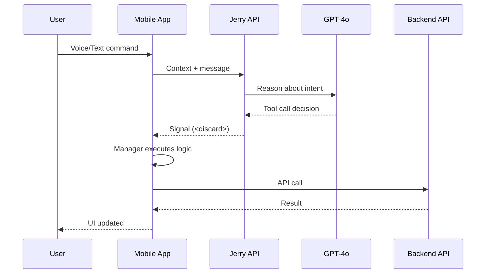
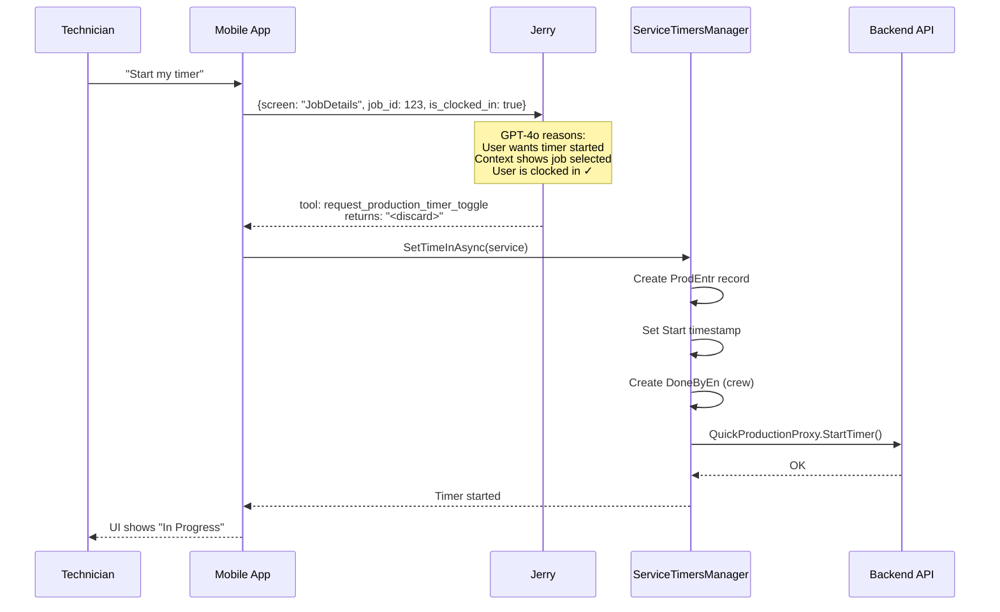
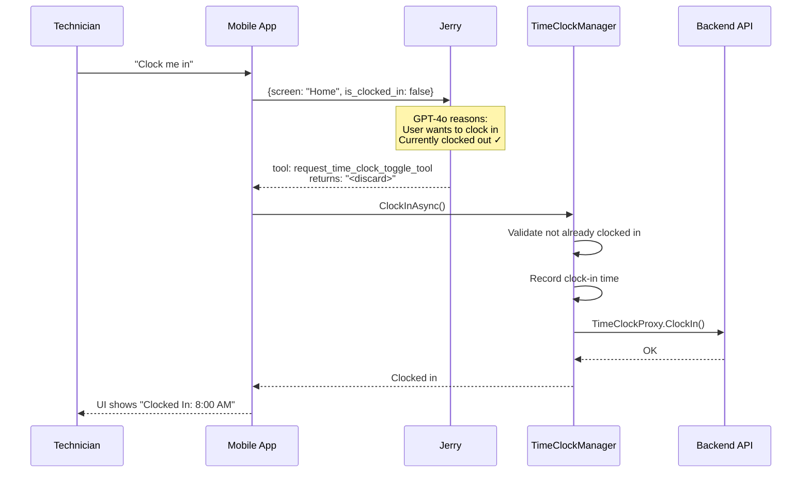
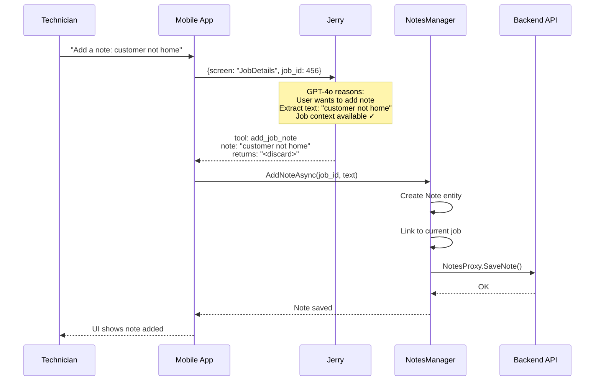
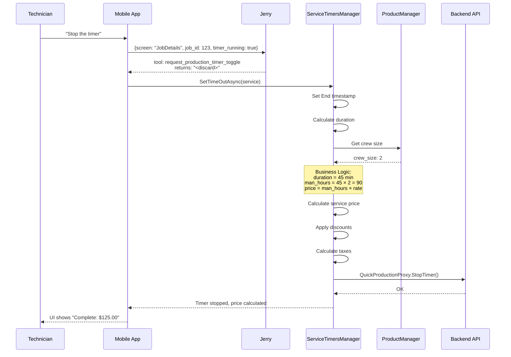

# Mobile ↔ Jerry Interaction Flows

Sequence diagrams showing how the mobile app and AI assistant work together.

---

## Core Pattern

Jerry **signals intent**, mobile app **executes logic**.

---

## Workflow 1: Start Timer

**User says:** "Start my timer"

---

## Workflow 2: Clock In

**User says:** "Clock me in"

---

## Workflow 3: Add Job Note

**User says:** "Add a note: customer not home"

---

## Workflow 4: Stop Timer (with pricing)

**User says:** "Stop the timer"

---

## Key Takeaways

1. **Jerry never touches business logic** — only decides which tool to call
2. **Managers contain the rules** — pricing, validation, state transitions
3. **Context is critical** — Jerry needs screen, entity ID, user state to decide correctly
4. **`<discard>` is a signal** — tells mobile app "execute this action" without displaying text
