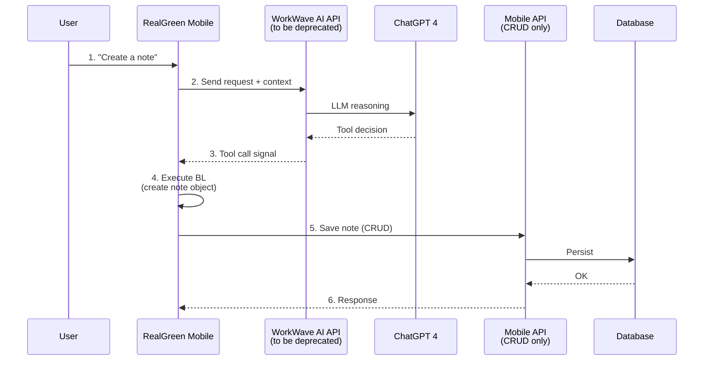
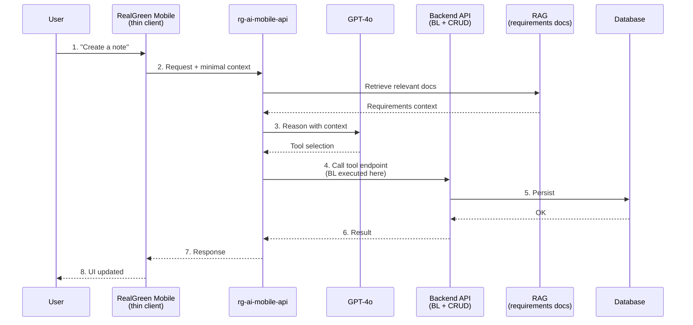
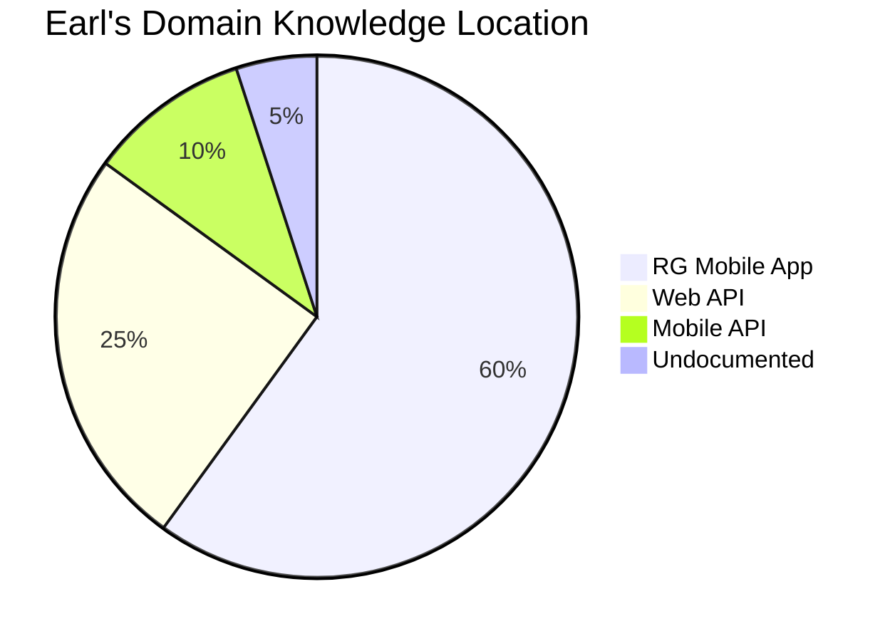

# Meeting Summary: Greg & Brianna

**Date:** 2026-02-03
**Attendees:** Greg (Chief Architect), Brianna (RG Mobile), Bogdan
**Topic:** Domain Discovery & AI Architecture

---

## Current State

**Problems identified:**
- Mobile app prepares payload, formats data, feeds to LLM — expensive
- Business logic scattered in mobile app (not centralized)
- RG APIs are just CRUD operations (no BL)
- Duplicate logic may exist in Web API

---

## Key Discussion Points

### Brianna's Perspective
- Current tool creation workflow is time-consuming
- Need centralized place to gather knowledge base
- Missing pieces require meetings with RG experts
- Grey area in knowledge ownership (discussed with Sobin)

### Greg's Perspective

**Architecture Problem:**
> "We have an arch issue. The mobile app prepares a payload, sends it to AI — a really expensive operation."

**Current anti-pattern:**
- List of tools, but mobile app does the heavy lifting
- Gets data from CRUD, formats it, feeds to LLM, reads response, formats again

**Proposed pattern:**
- Catalog of tools that AI agent chooses from
- Tools expose business logic as endpoints
- Centralized place for BL, not scattered in mobile

**On offline capability:**
- "Do we need offline for RG? Probably not"
- Product design may disagree, but BL would be better in backend

### RAG Discussion
- RAG for **requirements documents only**, not full data/KB aggregation
- Still need all business logic implemented (RAG doesn't replace BL)
- Centralized docs → RAG retrieval → better context for AI

---

## Deprecation Plan

| Component | Status | Replacement |
|-----------|--------|-------------|
| WorkWave AI API | To be deprecated | rg-ai-mobile-api |
| Mobile-side BL | Current | Move to API (web/mobile) |

---

## Brianna's Current Workflow (for new tools)

1. Sit down with Claude
2. Read the code
3. Create requirements doc
4. Put in central spot (reusable)
5. Implement endpoint iteratively

**Pain point:** Knowledge not centralized, requires Earl sessions.

---

## Proposed Architecture

**Key changes:**
- Mobile becomes thin client (less BL)
- API executes business logic
- RAG provides requirements context to AI
- AI calls API tools directly (not signals to mobile)

---

## Domain Knowledge Distribution

**Risk:** Potential duplicate logic between Web API and Mobile App.

---

## Action Items

| # | Action | Owner | Status |
|---|--------|-------|--------|
| 1 | Schedule meeting with RG domain expert (Earl) | Brianna | Pending |
| 2 | Identify BL candidates for API extraction | Greg/Brianna | Pending |
| 3 | Set up centralized requirements docs location | TBD | Pending |
| 4 | Evaluate RAG for requirements retrieval | TBD | Pending |
| 5 | Continue domain discovery workflow development | Bogdan | In Progress |

---

## Implications for Domain Discovery Workflow

| Original Assumption | Updated Understanding |
|--------------------|-----------------------|
| Document BL in mobile app | Also check Web API for duplicate BL |
| Jerry signals, mobile executes | Future: AI calls API tools directly |
| Focus on mobile Managers | Include API endpoints as extraction targets |
| Domain maps for AI tool builders | Also serve as requirements docs for RAG |

---

## Next Steps

1. **Short term:** Continue domain discovery to document current BL
2. **Medium term:** Use domain maps to identify extraction candidates
3. **Long term:** Migrate BL to API, domain maps become RAG source

---

## References

- [RG mobile app interactions.pdf](../RG%20mobile%20app%20interactions.pdf) - Architecture diagram from meeting
- [04-system-overview.md](04-system-overview.md) - Current system architecture
- [02-architecture-recommendation.md](02-architecture-recommendation.md) - Migration paths analysis
