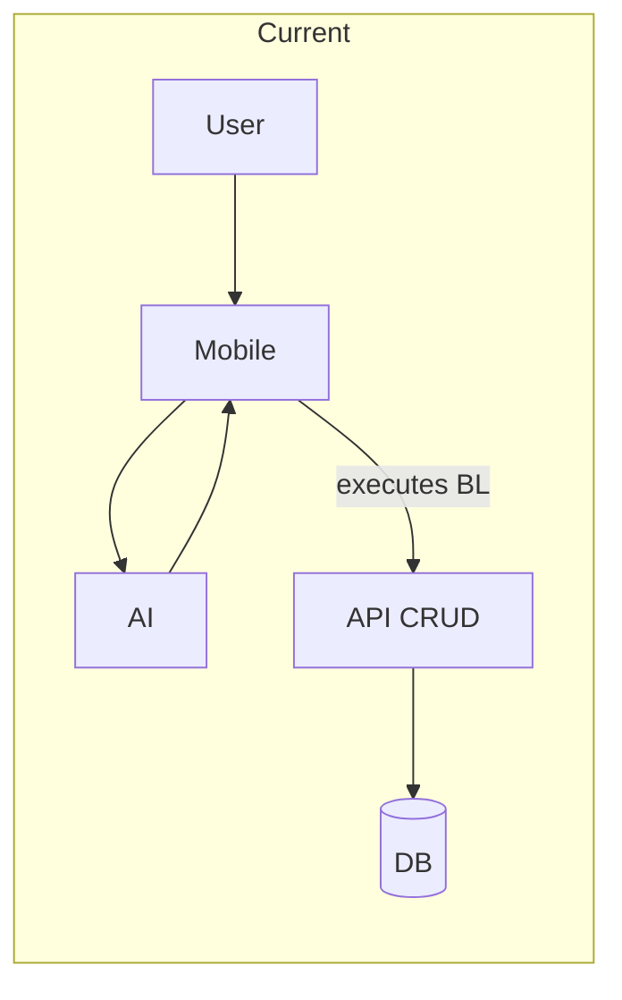
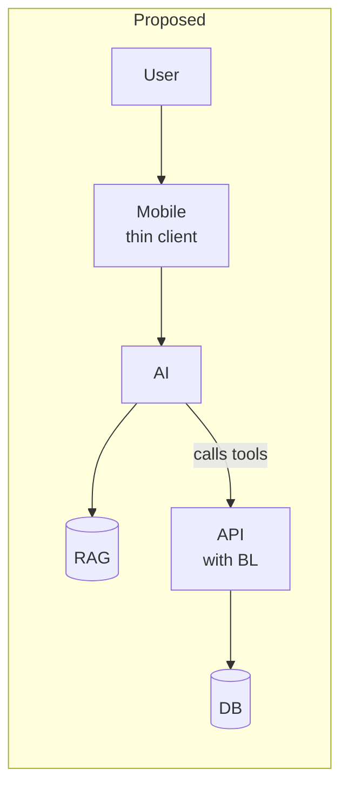

# Architecture Shift Summary

Key takeaways from Greg & Brianna meeting (2026-02-03).

---

## Current State → Proposed State

| Aspect | Current | Proposed |
|--------|---------|----------|
| **AI API** | WorkWave AI API | rg-ai-mobile-api |
| **BL location** | Mobile app (70%) | Backend API |
| **Mobile role** | Execute BL, format data | Thin client |
| **AI role** | Signal to mobile | Call API tools directly |
| **RAG** | Not used | Requirements docs only |

---

## Architecture Shift

**Current flow:**
```
User → Mobile → AI → GPT → AI → Mobile (executes BL) → API (CRUD) → DB
```

**Proposed flow:**
```
User → Mobile → AI → RAG → GPT → AI → API (executes BL) → DB
```





---

## New Risk Identified

- Web API may contain **duplicate business logic** (not just CRUD)
- Domain discovery should check both Mobile App AND Web API

---

## Updated Domain Discovery Focus

| Priority | Task |
|----------|------|
| 1 | Document mobile BL (current focus) |
| 2 | Check Web API for duplicate BL (new) |
| 3 | Domain maps become **extraction targets** for API migration |
| 4 | Domain maps serve as **RAG source** for requirements context |

---

## RAG Scope Clarification

| Use Case | In Scope | Out of Scope |
|----------|----------|--------------|
| Requirements docs retrieval | ✓ | |
| Domain maps as context | ✓ | |
| Full database aggregation | | ✗ |
| Real-time data queries | | ✗ |

---

## Next Steps

1. Continue domain mapping for mobile Managers
2. Audit Web API for existing BL
3. Identify extraction candidates
4. Structure domain maps as RAG-ready documents
