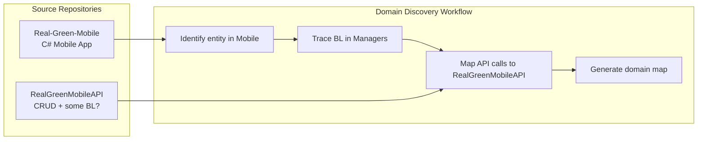

# Meeting Summary: Greg & Brianna

**Date:** 2026-02-04
**Attendees:** Greg (Chief Architect), Brianna (RG Mobile), Bogdan
**Topic:** Domain Discovery Workflow - Interim Direction

---

## Context

Following the architectural discussions from 2026-02-03, this meeting established the interim working approach while broader architectural decisions are pending.

---

## Key Decisions

### Pending: Architecture Working Group

Greg will convene a discussion with TLs and architecture-savvy stakeholders to determine:
- Proper location for business domain logic
- Repository structure / restructure approach
- RAG vs other approaches for knowledge management

**Status:** Scheduled, awaiting outcome

### Agreed: Continue Draft Workflow

Until the architecture working group reaches a decision, we proceed with developing the domain discovery workflow draft using:

| Repository | Purpose |
|------------|---------|
| `Real-Green-Mobile` | C# mobile app source code (BL discovery target) |
| `RealGreenMobileAPI` | API that mobile app calls for data persistence |

---

## Repository Access Status

| Repository | Access | Notes |
|------------|--------|-------|
| Real-Green-Mobile | ✅ Available | `/Volumes/NVMe/.../Real-Green-Mobile` |
| RealGreenMobileAPI | ✅ Available | `/Volumes/NVMe/.../RealGreenMobileAPI` |
| WorkWave AI API | ❓ No access | Unclear if needed |
| rg-ai-mobile-api | 🔄 Planned | Will be used, currently in planning phase |

---

## Workflow Scope (Interim)

---

## Implications

### What This Means for Discovery

1. **Primary target:** `Real-Green-Mobile` Managers (where BL lives)
2. **Secondary context:** `RealGreenMobileAPI` (understand what mobile calls)
3. **Out of scope (for now):** WorkWave AI API, rg-ai-mobile-api

### What Changes Later

Once the architecture working group decides:
- Workflow may need to expand to additional repositories
- Domain maps may serve as extraction specs (if BL moves to API)
- RAG integration approach will be clarified

---

## Action Items

| # | Action | Owner | Status |
|---|--------|-------|--------|
| 1 | Convene architecture working group | Greg | Pending |
| 2 | Update workflow to use Real-Green-Mobile + RealGreenMobileAPI | Bogdan | In Progress |
| 3 | Develop draft discovery workflow commands | Bogdan | In Progress |
| 4 | Report any blockers from repo access | Bogdan | Ongoing |

---

## Next Steps

1. Update `/discover-domain` command to target Real-Green-Mobile
2. Understand RealGreenMobileAPI structure for API call mapping
3. Test workflow on a sample entity (e.g., timers)
4. Await architecture working group outcome

---

## References

- [08-meeting-summary-2026-02-03.md](08-meeting-summary-2026-02-03.md) - Previous meeting context
- [09-architecture-shift-summary.md](09-architecture-shift-summary.md) - Architecture shift overview
