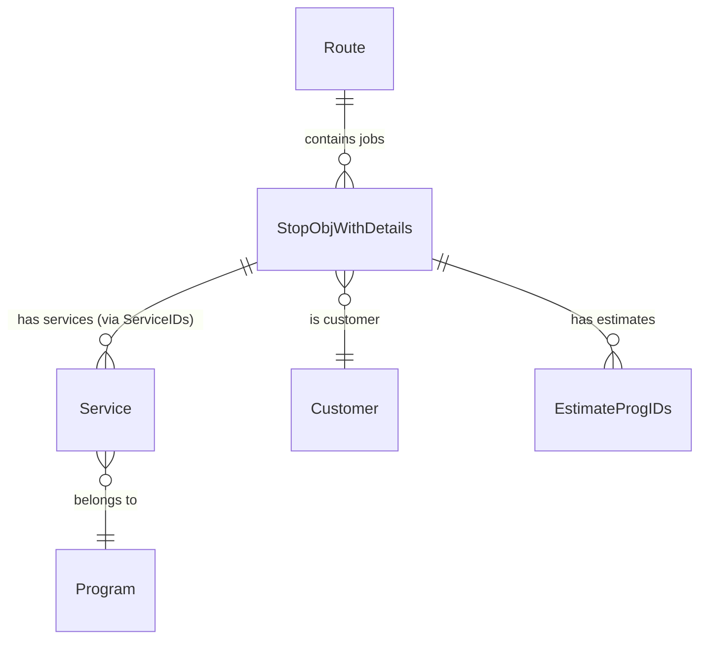

# Domain: Job/Route Listing

## Overview

- **Purpose:** Provide technicians with their daily work schedule, job details, and navigation context
- **Key concepts:** Route, Stop (job), Sequence, Customer, Services, Job indicators (ASAP, Call Ahead, etc.)

> **See also:** [Glossary](../glossary.md) for cross-domain terminology (Job vs Service, Customer, ServiceState, Job Indicators, etc.)

## Business Rules

> **Source repo:** `Real-Green-Mobile` (branch: `MOB-12830-AI-assistant-NEW`)

| Rule ID | Business Rule | Code Implementation | Source | Validated |
|---------|---------------|---------------------|--------|-----------|
| BR-001 | Jobs must be displayed in route sequence order, not by their position in the data array | Sequence field used for ordering | StopObjWithDetails.cs:28, AI prompt rules | [?] |
| BR-002 | A stop with customer number zero represents the depot/starting point, not a service location | Cust_No = 0 check for IsDepot property | StopObjWithDetails.cs:102-103 | [?] |
| BR-003 | A job is considered "Done" when at least one of its services has been completed | Done flag set based on service completion | StopObjWithDetails.cs:47-48 | [?] |
| BR-004 | Jobs with a promised time must prominently display the promised time string to the technician | HasPromisedTime triggers PromisedTimeString display | StopObjWithDetails.cs:39, AI prompt | [?] |
| BR-005 | Jobs requiring a call ahead must display a warning so technician calls before arriving | IsCallAhead triggers "Call Ahead Required" warning | StopObjWithDetails.cs:36, AI prompt | [?] |
| BR-006 | A job is marked as posted only when all its services are completed AND all auto-postable services have been posted | IsPosted set after service completion + auto-post | ServiceTimersManager influence | [?] |
| BR-007 | Route listing can be filtered by employee, date, route name, and/or crew | Filter parameters: employeeId, schedDate, route, crewId | RouteProxy.cs:27-46 | [?] |
| BR-008 | Each job in the enriched listing includes current weather data for the technician's location | Weather fetched and attached to EnrichedJobStopDto | ToolDispatcherService.cs:543-548 | [?] |
| BR-009 | Each job includes customer history insights (how long they've been a customer, last service date) | CustomerSince and LastTreatmentDate enrichment | ToolDispatcherService.cs:557-582 | [?] |
| BR-010 | Each job maintains a list of service IDs that link to individual service records | ServiceIDs list property on StopObjWithDetails | StopObjWithDetails.cs:53-55 | [?] |
| BR-011 | Job indicators are a defined set of flags (ASAP, PromisedTime, CallAhead, NewSale, Posted, ServiceCall, Confirmed, CreditHold) | JobIndicatorType enum | StopObjWithDetails.cs:160-171 | [?] |
| BR-012 | Jobs for customers on credit hold must be flagged so technician is aware of billing issues | OnCreditHold flag on job | StopObjWithDetails.cs:69 | [?] |

## Job Indicators

> **Source repo:** `Real-Green-Mobile`

| Indicator | Field | UI Implication |
|-----------|-------|----------------|
| IsASAP | `IsASAP` | Urgent priority display |
| IsPromisedTime | `HasPromisedTime` | Show `PromisedTimeString` |
| IsAssociatedServices | `IsAssociatedServices` | Multiple services linked |
| IsCallAhead | `IsCallAhead` | Warning: must call before arrival |
| IsNewSale | `IsNewSale` | New customer highlight |
| IsPosted | `IsPosted` | Job complete & posted |
| IsServiceCall | `IsServiceCall` | Service call vs scheduled |
| IsConfirmed | `IsConfirmed` | Customer confirmed appointment |
| IsOnCreditHold | `OnCreditHold` | Billing issue warning |

## Data Flow

### Get Jobs for Date

> **Source repos:** `Real-Green-Mobile` → `RealGreenMobileAPI`

| Step | Action | Entities Involved |
|------|--------|-------------------|
| 1 | Request route listing | RouteProxy |
| 2 | GET /DownloadRouteListing/DownloadCompleteRouteListing | API |
| 3 | Receive List<StopObjWithDetails> | StopObjWithDetails |
| 4 | Enrich with weather | WeatherManager |
| 5 | Enrich with customer history | CustomerInfoManager, ServiceManager |
| 6 | Return EnrichedJobStopDto list | ToolDispatcherService |

### Get Job Details (Program Records)

> **Source repos:** `Real-Green-Mobile` → `RealGreenMobileAPI`

| Step | Action | Entities Involved |
|------|--------|-------------------|
| 1 | Request program records for customer | RouteProxy |
| 2 | POST /DownloadRouteListing/DownloadRouteListingDetails | API |
| 3 | Receive ProgramRecords | Services, Customers, ServHists, Invoices, etc. |
| 4 | Process for AI response | ToolDispatcherService |

## Entity Relationships

> **Source repo:** `Real-Green-Mobile`

## Data Structure: StopObjWithDetails

> **Source repo:** `Real-Green-Mobile`

Key fields for AI consumption:

| Field | Type | Purpose |
|-------|------|---------|
| Cust_No | int | Customer identifier (PK) |
| FullName | string | Display name |
| FullAddress | string | Service address |
| Sequence | int | Route order |
| ServiceCodes | string | Comma-separated service types |
| ServiceIDs | List<int> | Links to Service entities |
| PriceText | string | Formatted price display |
| HasPromisedTime | bool | Time commitment flag |
| PromisedTimeString | string | Promised time display |
| IsCallAhead | bool | Call before arrival |
| Latitude/Longitude | double | GPS coordinates |

## API Touchpoints

> **Source repo:** `RealGreenMobileAPI`

| Operation | Endpoint | Method | Notes |
|-----------|----------|--------|-------|
| Get route listing | /DownloadRouteListing | GET | Basic listing |
| Get complete listing | /DownloadRouteListing/DownloadCompleteRouteListing | GET | With all details |
| Get program records | /DownloadRouteListing/DownloadRouteListingDetails | POST | Deep job data |

**API BL assessment:** Minimal - API aggregates data from database, mobile enriches with weather and history context.

## Uncertainties

- [?] How is route assignment determined? (Employee default route vs manual?)
- [?] What triggers IsASAP flag? (Manual or automatic?)
- [?] How does crewId filtering work vs route filtering?
- [?] Can jobs be reordered by technician or only dispatcher?
- [?] What determines HasIncompleteServices vs Done?
- [?] How fresh is weather data? Cached? Per-request?

## Planned AI Integration

> **Source repo:** `rg-ai-mobile-api` (status: planned)

> **Reference:** `rg_mobile_ai_api/tools/tools.py`
> **Tool:** `get_summary_tool`
> **Parameters:** `date: str, summary_type: Literal["JobList", "ServiceAggregation", "ProductAggregation"]`
> **Status:** Planned - pending architecture decision

The AI tool with `summary_type='JobList'` triggers `ToolDispatcherService.ExecuteGetSummary` which calls `GetJobList` and returns enriched job data including weather and customer history insights.

---

## Brianna's Comments & Requirements

_Section for validation feedback_

| Item | Brianna's Input | Action Needed |
|------|-----------------|---------------|
| BR-001 | | |
| BR-002 | | |
| BR-003 | | |
| BR-004 | | |
| BR-005 | | |
| BR-006 | | |
| BR-007 | | |
| BR-008 | | |
| BR-009 | | |
| BR-010 | | |
| BR-011 | | |
| BR-012 | | |

### Additional Rules Identified

_Space for rules Brianna identifies that were missed_

| Rule ID | Business Rule | Code Implementation | Source | Notes |
|---------|---------------|---------------------|--------|-------|
| | | | | |

### Edge Cases to Document

_Space for edge cases from domain expert knowledge_

1.
2.
3.

---

**Generated:** 2026-02-05
**Workflow version:** Draft v1
**Next review:** Pending Brianna validation
