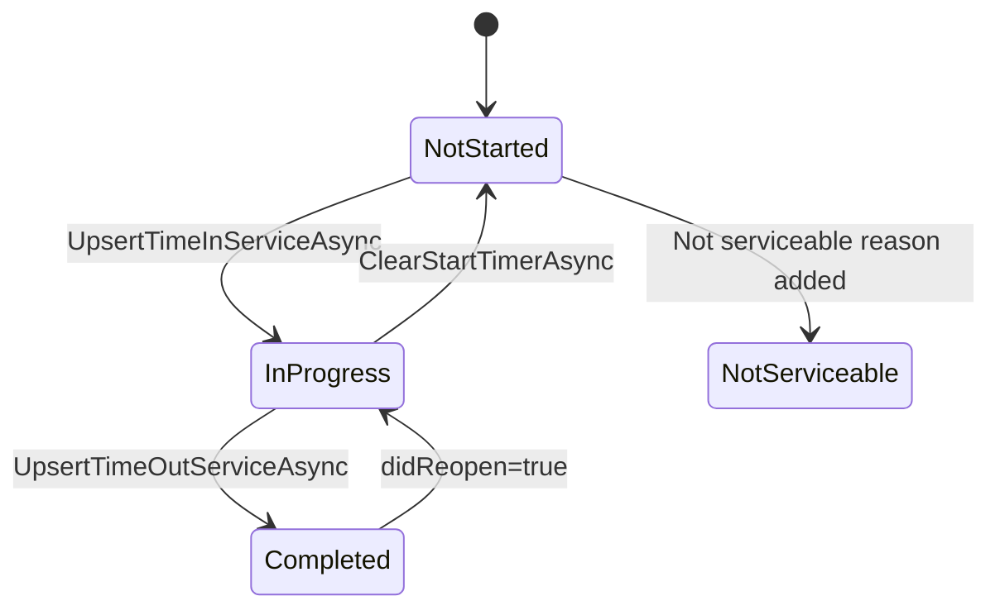
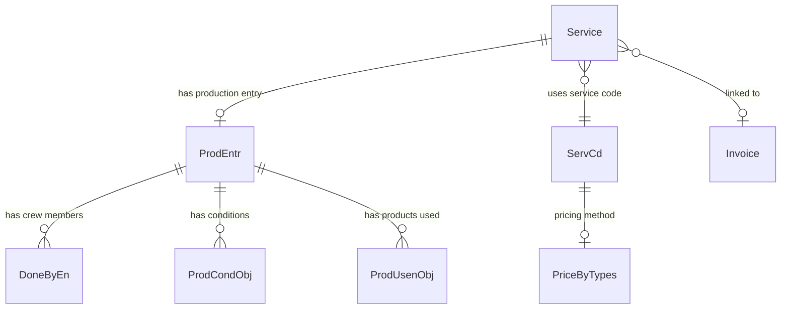

# Domain: Production Timers

## Overview

- **Purpose:** Track time spent on service jobs for billing, payroll, and productivity metrics
- **Key concepts:** Service timer, ProdEntr (production entry), crew size, man-hours, auto-post

## Business Rules

| Rule ID | Rule | Source | Validated |
|---------|------|--------|-----------|
| BR-001 | Timer cannot start if service has a "not serviceable" reason | ServiceTimersManager.cs:96-98 | [?] |
| BR-002 | Start time updates appointment time if `UpdateAptTimeWStartTime` config enabled | ServiceTimersManager.cs:103-108 | [?] |
| BR-003 | DoneDate defaults to punch date if not already set | ServiceTimersManager.cs:110-113 | [?] |
| BR-004 | Timer stop calculates duration as (End - Start) in minutes | ServiceTimersManager.cs:160-167 | [?] |
| BR-005 | CrewSize = count of DoneByEn records for the ProdEntr | ServiceTimersManager.cs:169 | [?] |
| BR-006 | ActManHour = Duration × CrewSize | ServiceTimersManager.cs:170-173 | [?] |
| BR-007 | Man-hour pricing recalculates service price if PriceBy = ManHour | ServiceTimersManager.cs:175-196 | [?] |
| BR-008 | Auto-post triggers if `AutoPostProduction` config OR service code has `Autopost` flag | ServiceTimersManager.cs:338, 380-387 | [?] |
| BR-009 | Timer can only stop if it has Start time OR has conditions recorded | ServiceTimersManager.cs:146 | [?] |
| BR-010 | Job marked as posted only when ALL services completed AND all auto-postable | ServiceTimersManager.cs:671-680 | [?] |
| BR-011 | Crew members copied from most recently started job | ServiceTimersManager.cs:240 | [?] |
| BR-012 | Timer balancing distributes time proportionally by service size (weight) | ServiceTimersManager.cs:511-543 | [?] |

## State Transitions

**ServiceState enum:** `NotStarted`, `InProgress`, `Completed`, `NotServiceable`

## Data Flow

| Step | Action | Entities Involved |
|------|--------|-------------------|
| 1 | User requests timer start | Service (by ID) |
| 2 | Check for existing ProdEntr or create new | ProdEntr |
| 3 | Check not-serviceable status | SrvNoSrv |
| 4 | Set Start time, update DoneDate | ProdEntr |
| 5 | Optionally update SchedTime | Service |
| 6 | Create/copy DoneByEn crew records | DoneByEn |
| 7 | Sync to API | POST /Production/StartQuickProdTimer |
| 8 | Publish ServiceStatusChangedEvent | BusManager |

### Timer Stop Flow

| Step | Action | Entities Involved |
|------|--------|-------------------|
| 1 | Set End time | ProdEntr |
| 2 | Calculate Duration, CrewSize, ActManHour | ProdEntr |
| 3 | Recalculate pricing if man-hour based | Service, ServCd |
| 4 | Update Invoice DoneDate if exists | Invoice |
| 5 | Check auto-post conditions | ServCd, SyncSettings |
| 6 | Sync to API | POST /Production/CompleteQuickProdTimer |
| 7 | Optionally auto-post | POST /Production/PostProduction |

## Entity Relationships

## API Touchpoints

| Operation | Endpoint | Method | Notes |
|-----------|----------|--------|-------|
| Start timer | /Production/StartQuickProdTimer | POST | Queued, async |
| Stop timer | /Production/CompleteQuickProdTimer | POST | Queued, async |
| Clear timer | /Production/ClearProductionTimer | POST | Deletes in-progress |
| Auto-post | /Production/PostProduction | POST | Final posting |
| Upload production | /Production/Upload | POST | Generic upload |

**API BL assessment:** Minimal - API is primarily CRUD/pass-through to database. All timer logic executed in mobile.

## Uncertainties

- [?] Can multiple technicians work the same service timer simultaneously?
- [?] What happens if timer spans midnight (cross-day)?
- [?] Is crew size ever > 1 in practice? How does UI support this?
- [?] What triggers the timer balancing feature? (CalculateNewJobsTimerData)
- [?] How does offline mode affect timer sync? Queue behavior?
- [?] What's the relationship between ProdEntr.Started flag and actual Start time?

## Planned AI Integration

> **Reference:** `rg-ai-mobile-api/rg_mobile_ai_api/tools/tools.py`
> **Tool:** `request_production_timer_toggle`
> **Parameters:** `cust_no: int, service_ids: List[int]`
> **Status:** Planned - pending architecture decision

The AI tool signals intent; mobile `ToolDispatcherService.ExecuteProductionTimerToggle` executes the BL by calling `ServiceTimersManager.UpsertTimeInServiceAsync` or `UpsertTimeOutServiceAsync`.

---

## Brianna's Comments & Requirements

_Section for validation feedback_

| Item | Brianna's Input | Action Needed |
|------|-----------------|---------------|
| BR-001 | | |
| BR-002 | | |
| BR-003 | | |
| BR-004 | | |
| BR-005 | | |
| BR-006 | | |
| BR-007 | | |
| BR-008 | | |
| BR-009 | | |
| BR-010 | | |
| BR-011 | | |
| BR-012 | | |

### Additional Rules Identified

_Space for rules Brianna identifies that were missed_

| Rule ID | Rule | Source | Notes |
|---------|------|--------|-------|
| | | | |

### Edge Cases to Document

_Space for edge cases from domain expert knowledge_

1.
2.
3.

---

**Generated:** 2026-02-05
**Workflow version:** Draft v1
**Next review:** Pending Brianna validation
