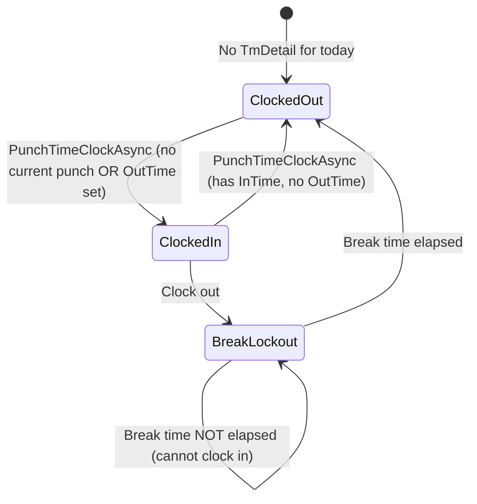
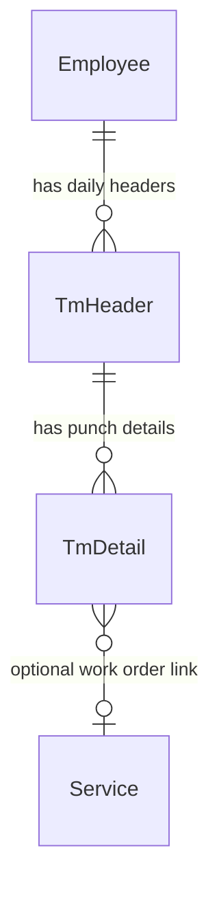

# Domain: Time Clock

## Overview

- **Purpose:** Track employee work hours for payroll, overtime calculation, and compliance
- **Key concepts:** TmHeader (daily container), TmDetail (individual punch), clock in/out, break lockout, overtime

## Business Rules

| Rule ID | Rule | Source | Validated |
|---------|------|--------|-----------|
| BR-001 | First punch of day creates new TmHeader + TmDetail | TimeClockManager.cs:74-98 | [?] |
| BR-002 | Subsequent punch after clock-out creates new TmDetail under same TmHeader | TimeClockManager.cs:108-128 | [?] |
| BR-003 | Punch when clocked in sets OutTime on current TmDetail | TimeClockManager.cs:130-137 | [?] |
| BR-004 | Clock-in punches employee out of all work orders (unless initiated by work order) | TimeClockManager.cs:101-104, 125-128 | [?] |
| BR-005 | Break lockout: Cannot clock in until required break minutes elapsed | ToolDispatcherService.cs:174-179 | [?] |
| BR-006 | Break lockout time configurable via `BreakLockoutTimeMinutes` setting | ToolDispatcherService.cs:169-170 | [?] |
| BR-007 | Employee clocked-in status = has TmDetail with InTime but no OutTime | TimeClockManager.cs:228-234 | [?] |
| BR-008 | InTime/OutTime stored as total minutes from midnight | DateTimeUtils.DateToTotalMinutes | [?] |
| BR-009 | Overtime calculated based on employee OvertimeType (Daily or Weekly) | TimeClockManager.cs:202-221 | [?] |
| BR-010 | Daily overtime: Minutes > OTStart threshold become OT_Min | TimeClockManager.cs:202-208 | [?] |
| BR-011 | Weekly overtime: Cumulative minutes across week > OTStart | TimeClockManager.cs:210-220 | [?] |

## State Transitions

**Clock status determination:** `InTime.HasValue && !OutTime.HasValue`

## Data Flow

### Clock In Flow

| Step | Action | Entities Involved |
|------|--------|-------------------|
| 1 | Get current employee | Employee |
| 2 | Check for existing TmDetail today | TmDetail |
| 3a | If no TmDetail: Create TmHeader + TmDetail | TmHeader, TmDetail |
| 3b | If has TmDetail with OutTime: Create new TmDetail | TmDetail |
| 4 | Set InTime = current minutes from midnight | TmDetail |
| 5 | Punch out of all work orders | TmDetail (work order punches) |
| 6 | Sync to API | PUT /InsertUpdate/TmHeader, /TmDetail |

### Clock Out Flow

| Step | Action | Entities Involved |
|------|--------|-------------------|
| 1 | Get current TmDetail (has InTime, no OutTime) | TmDetail |
| 2 | Set OutTime = current minutes from midnight | TmDetail |
| 3 | Recalculate hours (overtime logic) | TmHeader |
| 4 | Sync to API | PUT /InsertUpdate/TmDetail |

### Break Lockout Check (AI Tool)

| Step | Action | Entities Involved |
|------|--------|-------------------|
| 1 | Get break lockout config | ConfigurationManager |
| 2 | Get current punch | TmDetail |
| 3 | If OutTime exists, check if break time elapsed | TmDetail.OutTime |
| 4 | If not elapsed, throw exception | - |

## Entity Relationships

## API Touchpoints

| Operation | Endpoint | Method | Notes |
|-----------|----------|--------|-------|
| Upsert header | /InsertUpdate/TmHeader | PUT | Queued |
| Upsert detail | /InsertUpdate/TmDetail | PUT | Queued |
| Refresh time clock | /Employee/RefreshTimeClock | POST | Bidirectional sync |

**API BL assessment:** Minimal - API stores records, mobile handles punch logic and overtime calculation.

## Uncertainties

- [?] How does work order punch differ from main time clock punch?
- [?] Is break lockout enforced server-side or only client-side?
- [?] What happens if employee spans midnight while clocked in?
- [?] How is ProdID on TmDetail used? (Production type?)
- [?] RecalculateHoursAsync marked obsolete - is overtime calculation still functional?
- [?] Local time vs UTC noted as a problem in code comments - is this resolved?

## Planned AI Integration

> **Reference:** `rg-ai-mobile-api/rg_mobile_ai_api/tools/tools.py`
> **Tool:** `request_time_clock_toggle_tool`
> **Parameters:** None (toggle based on current state)
> **Status:** Planned - pending architecture decision

The AI tool triggers `ToolDispatcherService.ExecuteTimeClockToggle` which:
1. Checks break lockout if clocking in
2. Calls `TimeClockManager.PunchTimeClockAsync`
3. Returns confirmation message

---

## Brianna's Comments & Requirements

_Section for validation feedback_

| Item | Brianna's Input | Action Needed |
|------|-----------------|---------------|
| BR-001 | | |
| BR-002 | | |
| BR-003 | | |
| BR-004 | | |
| BR-005 | | |
| BR-006 | | |
| BR-007 | | |
| BR-008 | | |
| BR-009 | | |
| BR-010 | | |
| BR-011 | | |

### Additional Rules Identified

_Space for rules Brianna identifies that were missed_

| Rule ID | Rule | Source | Notes |
|---------|------|--------|-------|
| | | | |

### Edge Cases to Document

_Space for edge cases from domain expert knowledge_

1.
2.
3.

---

**Generated:** 2026-02-05
**Workflow version:** Draft v1
**Next review:** Pending Brianna validation
