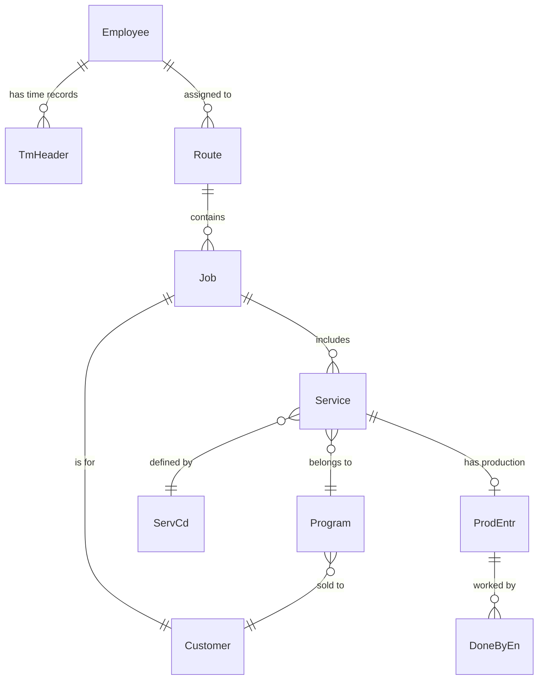

# Domain Glossary

Cross-domain terminology for RealGreen Mobile business logic.

> **Audience:** Developers and domain experts

> **Status:** Draft - pending validation

---

## Core Entities

### Customer (Cust_No)

| Aspect | Details |
|--------|---------|
| **Business meaning** | A property owner or business receiving lawn/pest services |
| **Technical identifier** | `Cust_No` (integer) |
| **Special values** | `Cust_No = 0` represents the depot (starting point), not a customer |
| **Appears in** | Jobs, Timers, all service-related domains |
| **Key relationships** | Has Programs → has Services → has ProdEntrs |

### Employee (Emp_ID)

| Aspect | Details |
|--------|---------|
| **Business meaning** | A technician or field worker performing services |
| **Technical identifier** | `Emp_ID` (string) |
| **Appears in** | Time Clock, Timers, Jobs |
| **Key properties** | OvertimeType (Daily/Weekly), OTStart threshold, ProdID |

### Service

| Aspect | Details |
|--------|---------|
| **Business meaning** | A specific work item to be performed (e.g., "Lawn Treatment", "Pest Control") |
| **Technical identifier** | `Service_ID` (integer) |
| **Appears in** | Jobs (via ServiceIDs list), Timers |
| **Key relationships** | Belongs to Program, has ProdEntr, linked to ServCd (service code definition) |
| **States** | Determined by ProdEntr: NotStarted, InProgress, Completed, NotServiceable |

### Job (Stop)

| Aspect | Details |
|--------|---------|
| **Business meaning** | A scheduled visit to a customer location; may include multiple services |
| **Technical representation** | `StopObjWithDetails` |
| **Appears in** | Job/Route Listing |
| **Key distinction** | Job ≠ Service. A job is a customer stop; services are the work items at that stop |
| **Ordering** | By `Sequence` number, not array index |

### Program

| Aspect | Details |
|--------|---------|
| **Business meaning** | A recurring service plan for a customer (e.g., "Annual Lawn Care Program") |
| **Technical identifier** | `Prog_ID` (integer) |
| **Appears in** | Jobs, Timers |
| **Key relationships** | Belongs to Customer, contains Services |

---

## Production & Time Tracking

### ProdEntr (Production Entry)

| Aspect | Details |
|--------|---------|
| **Business meaning** | A record tracking time and work performed for a single service |
| **Technical identifier** | `ProdEntrID` / `MobileGUID` |
| **Appears in** | Production Timers |
| **Key fields** | Start, End, Duration, CrewSize, ActManHour |
| **Lifecycle** | Created on timer start → updated on timer stop → optionally posted |

### DoneByEn (Done By Entry)

| Aspect | Details |
|--------|---------|
| **Business meaning** | A crew member record for a production entry; tracks who worked on a service |
| **Technical identifier** | Links to `ProdEntrMobileGUID` |
| **Appears in** | Production Timers |
| **Key behavior** | Copied from most recently started job when timer starts |

### Crew

| Aspect | Details |
|--------|---------|
| **Business meaning** | A group of employees working together on a route |
| **Technical identifier** | `crewId` (optional filter) |
| **Appears in** | Jobs, Timers |
| **Key calculation** | CrewSize = count of DoneByEn records for a ProdEntr |

### TmHeader / TmDetail (Time Clock)

| Aspect | Details |
|--------|---------|
| **Business meaning** | Employee time punch records for payroll |
| **Structure** | TmHeader = daily container; TmDetail = individual punch (in/out) |
| **Appears in** | Time Clock |
| **Key fields** | InTime, OutTime (minutes from midnight), Reg_Min, OT_Min |

---

## States & Statuses

### ServiceState

| State | Meaning | Determination |
|-------|---------|---------------|
| `NotStarted` | Timer not started | No ProdEntr.Start |
| `InProgress` | Timer running | ProdEntr.Start set, no End |
| `Completed` | Timer stopped | ProdEntr.Start and End both set |
| `NotServiceable` | Cannot be serviced | Has entry in SrvNoSrv table |

### JobStatus

| Status | Meaning |
|--------|---------|
| `NotExecutable` | No services to perform |
| `InProgress` | At least one service started but not all completed |
| `Completed` | All services completed |

### Posted

| Aspect | Details |
|--------|---------|
| **Business meaning** | Work has been finalized and synced to backend for billing/reporting |
| **Trigger** | Manual post OR auto-post (based on config or service code) |
| **Job level** | Job is posted when ALL services completed AND all auto-postable |

---

## Configuration & Rules

### Auto-post

| Aspect | Details |
|--------|---------|
| **Business meaning** | Automatic posting of completed work without manual intervention |
| **Controlled by** | `AutoPostProduction` config setting OR `ServCd.Autopost` flag per service code |
| **Appears in** | Production Timers |

### Break Lockout

| Aspect | Details |
|--------|---------|
| **Business meaning** | Enforced break time before employee can clock back in |
| **Controlled by** | `BreakLockoutTimeMinutes` config setting |
| **Appears in** | Time Clock |

### Man-Hour Pricing

| Aspect | Details |
|--------|---------|
| **Business meaning** | Service price calculated based on time worked × rate |
| **Trigger** | `ServCd.PriceBy = ManHour` |
| **Formula** | `Price = CalculateManHourPrice(Duration, ManHrRate, BasePrice, CrewSize)` |
| **Appears in** | Production Timers |

---

## Job Indicators

Flags on jobs that affect technician workflow:

| Indicator | Meaning | Action Required |
|-----------|---------|-----------------|
| `IsASAP` | Urgent priority | Service immediately |
| `HasPromisedTime` | Time commitment made | Arrive by PromisedTimeString |
| `IsCallAhead` | Must call before arriving | Call customer first |
| `IsNewSale` | New customer | May need extra attention |
| `IsServiceCall` | Unscheduled service request | Different from routine visit |
| `IsConfirmed` | Customer confirmed appointment | Expected at location |
| `OnCreditHold` | Billing issue | Be aware, may affect service |

---

## API Patterns

### Queued Requests

| Aspect | Details |
|--------|---------|
| **Pattern** | Mobile app queues API calls for async processing |
| **Implementation** | `QueuableHttpMessage` + `PersistentClient.QueueRequestAsync` |
| **Used for** | Timer start/stop, time clock punches, production uploads |
| **Benefit** | Offline support, reliability |

### Proxy Classes

| Aspect | Details |
|--------|---------|
| **Pattern** | Mobile app uses Proxy classes to encapsulate API calls |
| **Examples** | `RouteProxy`, `TimeClockProxy`, `JobProductionProxy` |
| **Location** | `RG.Mobile.Core/ServerAccess/Proxies/` |

---

## Cross-Domain Relationships

---

## Terms Pending Clarification

| Term | Question | Domain |
|------|----------|--------|
| Route vs Crew | How do these differ for filtering? Can an employee be on multiple? | Jobs |
| Work Order Punch | How does this differ from main time clock? | Time Clock |
| ProdID on TmDetail | What is this production type ID? | Time Clock |
| Service vs Special | What distinguishes a "special" service? | Jobs |

---

**Generated:** 2026-02-05
**Workflow version:** Draft v1
**Next review:** Pending Brianna/Earl validation
