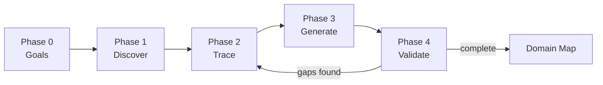

# Domain Discovery Playbook

Step-by-step workflow for generating domain maps from RealGreen Mobile codebase.

## Prerequisites

- Claude Code installed
- Access to `Real-Green-Mobile` and `rg-ai-mobile-api` repos
- Domain expert (Earl) available for validation

## Workflow Overview



---

## Phase 0: Goals (Interactive)

**Command:** Part of `/discover-domain`

Before generating, Claude asks:
1. What entity/domain are we mapping? (e.g., Timers, Services, Customers)
2. What AI capability needs this? (e.g., "agent should stop timers")
3. What's unclear that Earl should validate?

**Output:** Scoped discovery plan

---

## Phase 1: Discover

**Command:** `/discover-domain [entity]`

**Actions:**
1. Find relevant Manager classes in `Managers/`
2. Identify entry points (public methods, event handlers)
3. Map AI tool connections in `rg-ai-mobile-api` tools
4. List related entities and proxies

**Quality Gate:**
- [ ] Primary manager identified
- [ ] Entry points listed
- [ ] AI tool mapping found (if exists)
- [ ] Related entities catalogued

---

## Phase 2: Trace

**Reuses:** `/trace-operation` from **ww-mi-004-brownfield-documentation-generation-workflow**

**Actions:**
1. Follow call chains from entry points
2. Capture business rules (validation, calculations, state changes)
3. Document side effects (DB writes, API calls, events)
4. Flag uncertainties for expert validation

**Quality Gate:**
- [ ] Call chain documented
- [ ] Business rules extracted
- [ ] Side effects listed
- [ ] Uncertainties flagged with `[?]`

---

## Phase 3: Generate

**Command:** Part of `/discover-domain`

**Actions:**
1. Generate domain map using template
2. Create Mermaid diagrams (state machine, data flow)
3. List business rules with validation status
4. Add acceptance criteria templates

**Output:** `docs/domains/[entity].md`

**Quality Gate:**
- [ ] Template sections complete
- [ ] Diagrams render correctly
- [ ] Rules marked as `[inferred]` or `[validated]`

---

## Phase 4: Validate

**Command:** `/validate-domain [entity]`

**Actions:**
1. Review domain map with Earl
2. Confirm/correct business rules
3. Add missing edge cases
4. Mark rules as validated

**Quality Gate:**
- [ ] All `[?]` uncertainties resolved
- [ ] All rules marked `[validated]`
- [ ] Edge cases documented
- [ ] Earl sign-off obtained

---

## Commands Reference

| Command | When to Use | Reuses From |
|---------|-------------|-------------|
| `/discover-domain [entity]` | Start domain mapping | `/discover-operations` patterns |
| `/validate-domain [entity]` | Expert review session | New |
| `/check-domain-staleness` | Maintenance | `/check-docs-staleness` |

---

## Example: Timers Domain

```bash
# Step 1: Discover
/discover-domain timers

# Output: Found ServiceTimersManager, ProductManager
#         Entry points: SetTimeInAsync, SetTimeOutAsync
#         AI tool: request_production_timer_toggle
#         Uncertainties: [?] Single timer per tech? [?] Crew size calculation?

# Step 2: Review draft
# Claude generates docs/domains/timers.md

# Step 3: Validate
/validate-domain timers

# Output: Interactive session with Earl
#         [?] Single timer per tech? → Yes, enforced by app state
#         [?] Crew size calculation? → Multiplies duration, not rate
```

---

## Success Metrics

| Metric | Before | Target |
|--------|--------|--------|
| Discovery time | 1-2 days | 2-4 hours |
| Expert consultations | 3-5 per feature | 0-1 |
| Missed edge cases | 1-2 per feature | 0 |
| AI draft completeness | N/A | 80%+ |

---

## Maintenance

Run periodically to detect stale domain maps:

```bash
/check-domain-staleness
```

Triggers re-validation when:
- Manager code changed significantly
- New business rules added
- AI tools modified
