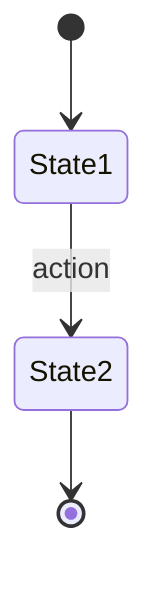
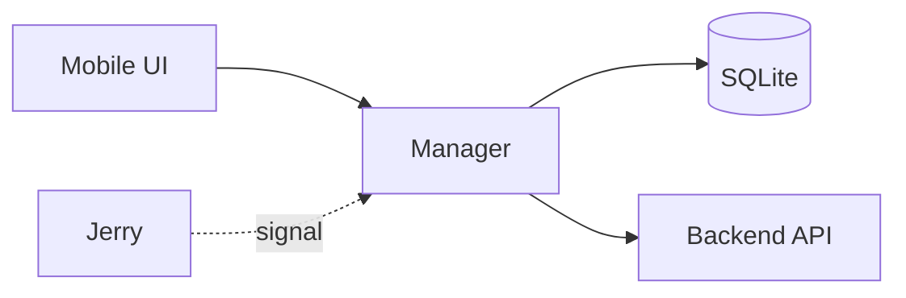

# Domain: [Entity Name]

> [One-line description of what this domain handles]

**Status:** Draft | Validated
**Last Updated:** YYYY-MM-DD
**Validated By:** [Domain Expert Name]

---

## Overview

[2-3 sentences explaining what this domain does and why it matters]

**Key Manager:** `[Manager]Manager.cs`
**AI Tool:** `[tool_name]` (if applicable)

---

## Code Entry Points

| Location | Method | Trigger | Purpose |
|----------|--------|---------|---------|
| [Manager].cs | `MethodAsync()` | User action / AI tool | [Description] |

---

## Business Rules

| ID | Rule | Source | Status |
|----|------|--------|--------|
| RULE_001 | [Description] | Code / Earl / Inferred | [validated] / [?] |

### Rule Details

#### RULE_001: [Rule Name]

**Description:** [Full explanation]

**Code Reference:** `[File]:[Line]`

**Validation:** [?] Needs expert confirmation | [validated] Confirmed YYYY-MM-DD

---

## State Machine

---

## Data Flow

---

## Side Effects

| Action | Effect | Reversible |
|--------|--------|------------|
| [Method] | Writes to [table] | Yes/No |
| [Method] | Calls [API endpoint] | N/A |
| [Method] | Publishes [event] | N/A |

---

## Edge Cases

| Scenario | Expected Behavior | Source |
|----------|-------------------|--------|
| [Edge case] | [What should happen] | Code / Earl |

---

## Dependencies

| Dependency | Type | Purpose |
|------------|------|---------|
| [OtherManager] | Internal | [Why needed] |
| [Proxy] | API | [What it fetches] |
| [Entity] | Data | [How it's used] |

---

## Pitfalls / Warnings

- [Thing that caught us off guard]
- [Non-obvious behavior]
- [Legacy quirk]

---

## Acceptance Criteria Template

When implementing features for this domain, verify:

- [ ] [Criterion based on RULE_001]
- [ ] [Criterion based on edge case]
- [ ] [Criterion based on side effect]

---

## Changelog

| Date | Change | Author |
|------|--------|--------|
| YYYY-MM-DD | Initial draft | Claude |
| YYYY-MM-DD | Validated with Earl | [Name] |
